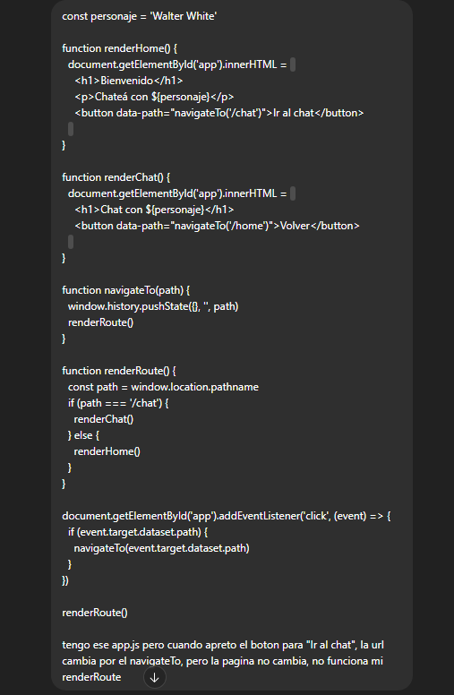
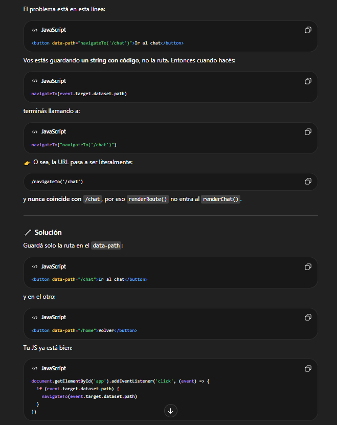
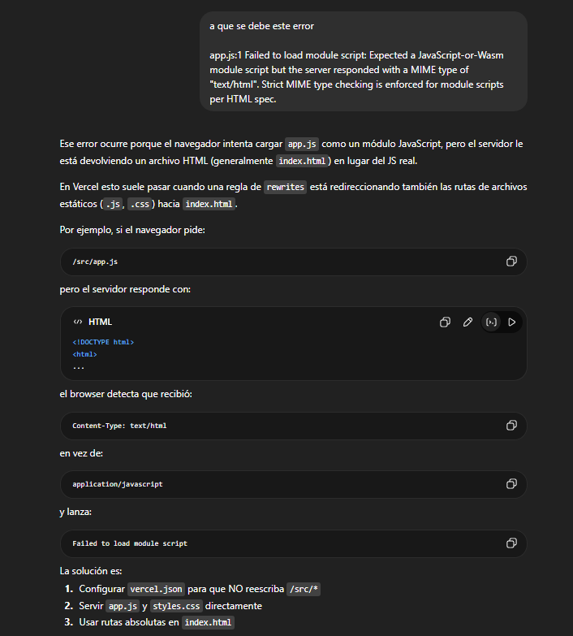
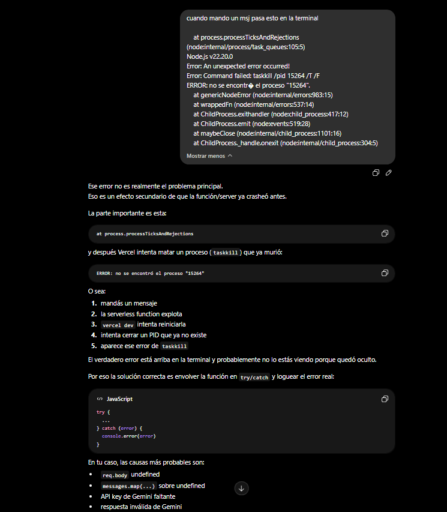
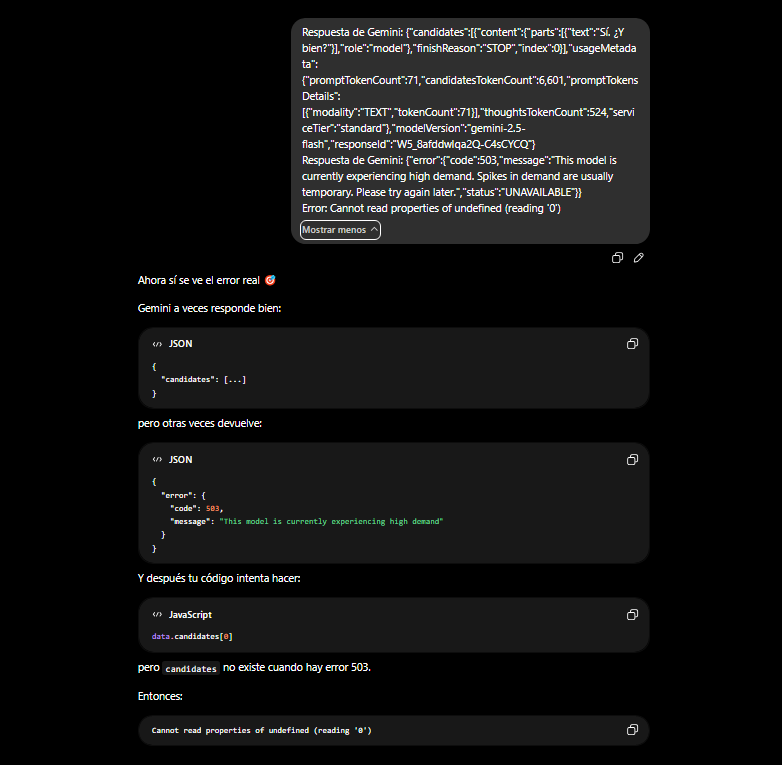
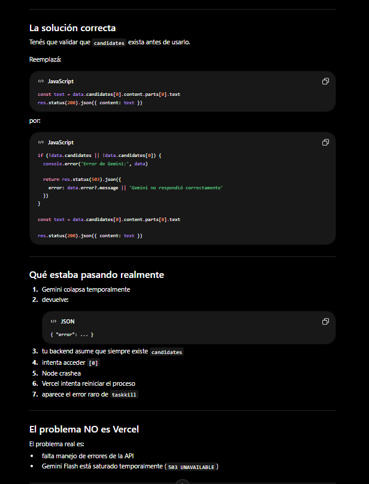
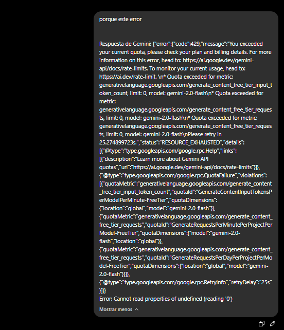
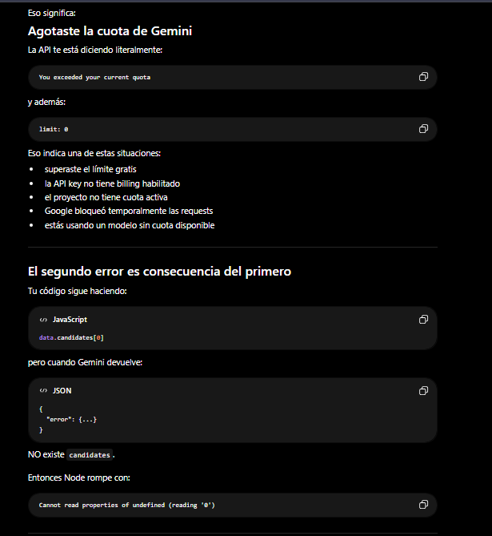
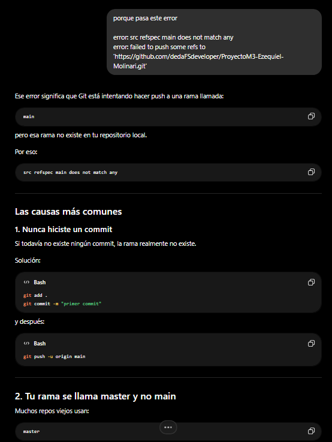

# AI Chat — Proyecto Integrador 3

Aplicación web donde podés chatear con personajes ficticios usando inteligencia artificial.

## Personajes disponibles
- Walter White (Breaking Bad)
- Sherlock Holmes (Sherlock BBC)  
- Jack Sparrow (Piratas del Caribe)

## Requisitos
- Node.js instalado
- Cuenta en Vercel
- API key de Google Gemini

## Correr localmente
1. Clonar el repositorio
2. Crear archivo `.env` basado en `.env.example`
3. Agregar tu `GEMINI_API_KEY` en el `.env`
4. Instalar Vercel CLI: `npm install -g vercel`
5. Correr: `vercel dev`
6. Abrir `http://localhost:3000`

## Correr tests
npm test

## Deploy en Vercel
1. Subir repositorio a GitHub
2. Importar proyecto en vercel.com
3. Agregar variable de entorno `GEMINI_API_KEY`
4. Deploy automático

## Link producción
https://proyecto-m3-ezequiel-molinari-ycvj.vercel.app/

### Uso de IA en el desarrollo

